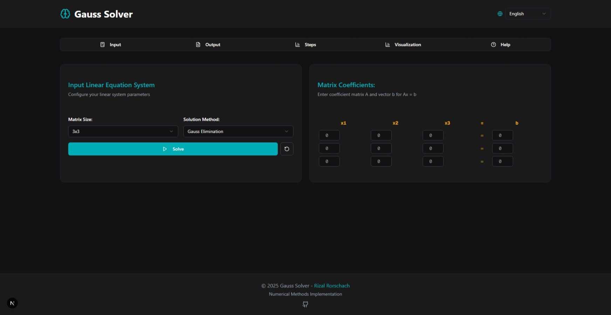

# 🧮 Gauss Solver

A modern, interactive web-based application for solving systems of linear equations using numerical methods. Built with Next.js and featuring beautiful UI, step-by-step solutions, and multilingual support.



[](https://vercel.com/new/clone?repository-url=https://github.com/rizalrorschach/gauss-solver)
[](https://github.com/rizalrorschach/gauss-solver)
[](https://github.com/rizalrorschach/gauss-solver/blob/main/LICENSE)

## ✨ Features

- **🎯 Interactive Matrix Input**: Dynamic matrix sizing (2x2 to 6x6) with intuitive input fields
- **⚡ Multiple Solution Methods**:
  - Gauss Elimination
  - Gauss-Jordan Elimination
- **📊 Step-by-Step Solutions**: Detailed breakdown of each elimination step
- **📈 Visualization**: Interactive charts and graphs of the solution process
- **🌐 Multilingual Support**: Multiple language options for global accessibility
- **📱 Responsive Design**: Optimized for desktop, tablet, and mobile devices
- **🎨 Modern UI**: Clean, dark theme with smooth animations
- **💾 Export Options**: Save solutions in various formats
- **🔄 Auto-tab Navigation**: Automatically switches to output tab when solving completes

## 🛠️ Technologies Used

- **Frontend Framework**: [Next.js 14](https://nextjs.org/) - React framework with App Router
- **Language**: [TypeScript](https://www.typescriptlang.org/) - Type-safe JavaScript
- **Styling**: [Tailwind CSS](https://tailwindcss.com/) - Utility-first CSS framework
- **UI Components**: [shadcn/ui](https://ui.shadcn.com/) - Beautiful and accessible components
- **Icons**: [Lucide Icons](https://lucide.dev/) - Beautiful open-source icons
- **State Management**: React Context API
- **Deployment**: [Vercel](https://vercel.com/) - Optimal for Next.js applications

## 🚀 Getting Started

### Prerequisites

- **Node.js** (version 18.0 or higher)
- **Package Manager**: npm, yarn, pnpm, or bun

### Installation

1. **Clone the repository**:

   ```bash
   git clone https://github.com/rizalrorschach/gauss-solver.git
   cd gauss-solver
   ```

2. **Install dependencies**:

   ```bash
   npm install
   # or
   yarn install
   # or
   pnpm install
   ```

3. **Run the development server**:

   ```bash
   npm run dev
   # or
   yarn dev
   # or
   pnpm dev
   ```

4. **Open your browser** and navigate to [http://localhost:3000](http://localhost:3000)

### Build for Production

```bash
npm run build
npm start
```

## 📖 Usage

### Basic Example

1. **Select Matrix Size**: Choose from 2x2 to 6x6 matrices
2. **Choose Method**: Select either Gauss Elimination or Gauss-Jordan Elimination
3. **Input Values**: Enter coefficients and constants
4. **Solve**: Click the solve button and view results in the Output tab

### Sample System of Equations

For the system:

```
2x + 3y = 7
4x - y = 1
```

Input matrix:

```
| 2   3 | = | 7 |
| 4  -1 | = | 1 |
```

The solution will be automatically calculated and displayed with step-by-step process.

## 🏗️ Project Structure

```
gauss-solver/
├── app/                    # Next.js app directory
│   ├── globals.css        # Global styles
│   ├── layout.tsx         # Root layout
│   └── page.tsx          # Main page
├── components/            # Reusable components
│   ├── ui/               # shadcn/ui components
│   ├── input-section.tsx # Matrix input interface
│   ├── output-section.tsx# Solution display
│   ├── steps-section.tsx # Step-by-step breakdown
│   └── visualization-section.tsx # Charts and graphs
├── contexts/             # React contexts
│   ├── language-context.tsx # Internationalization
│   └── solver-context.tsx   # Solver state management
├── lib/                  # Utilities and core logic
│   ├── solver.ts         # Numerical methods implementation
│   ├── export.ts         # Export functionality
│   └── utils.ts          # Helper functions
└── public/              # Static assets
```

## 🔧 API Reference

### Solver Functions

#### `solveLinearSystem(matrix, vector, method)`

Solves a system of linear equations using the specified method.

**Parameters:**

- `matrix`: 2D array representing the coefficient matrix
- `vector`: Array representing the constants vector
- `method`: `'gauss'` or `'gauss-jordan'`

**Returns:**

- `solution`: Array of variable values or `null` if no solution
- `steps`: Array of solution steps for visualization
- `status`: `'solved'`, `'no-solution'`, `'infinite-solutions'`, or `'error'`

## 🌐 Deployment

### Deploy to Vercel (Recommended)

[](https://vercel.com/new/clone?repository-url=https://github.com/rizalrorschach/gauss-solver)

### Manual Deployment

1. **Build the application**:

   ```bash
   npm run build
   ```

2. **Deploy to your preferred platform**:
   - [Vercel](https://vercel.com/)
   - [Netlify](https://netlify.com/)
   - [Railway](https://railway.app/)
   - [DigitalOcean App Platform](https://www.digitalocean.com/products/app-platform)

## 🤝 Contributing

Contributions are welcome! Please feel free to submit a Pull Request.

### Development Workflow

1. **Fork the repository**
2. **Create a feature branch**: `git checkout -b feature/amazing-feature`
3. **Make your changes**
4. **Test thoroughly**
5. **Commit your changes**: `git commit -m 'Add amazing feature'`
6. **Push to the branch**: `git push origin feature/amazing-feature`
7. **Open a Pull Request**

### Code Style

- Follow the existing TypeScript and React patterns
- Use Tailwind CSS for styling
- Maintain responsive design principles
- Add proper type annotations

## 📝 License

This project is licensed under the MIT License - see the [LICENSE](LICENSE) file for details.

## 👨‍💻 Author

**Rizal Rorschach**

- Website: [rizalize.com](https://rizalize.com)
- GitHub: [@rizalrorschach](https://github.com/rizalrorschach)

## 🙏 Acknowledgments

- [Next.js](https://nextjs.org/) team for the amazing framework
- [shadcn](https://ui.shadcn.com/) for the beautiful UI components
- [Vercel](https://vercel.com/) for hosting and deployment
- The open-source community for inspiration and tools

## 📊 Mathematical Background

### Gauss Elimination

Gauss elimination is a method for solving systems of linear equations by transforming the augmented matrix to row echelon form through elementary row operations.

### Gauss-Jordan Elimination

An extension of Gauss elimination that continues the elimination process to achieve reduced row echelon form, directly providing the solution without back-substitution.

---

⭐ **Star this repository if you found it helpful!**
